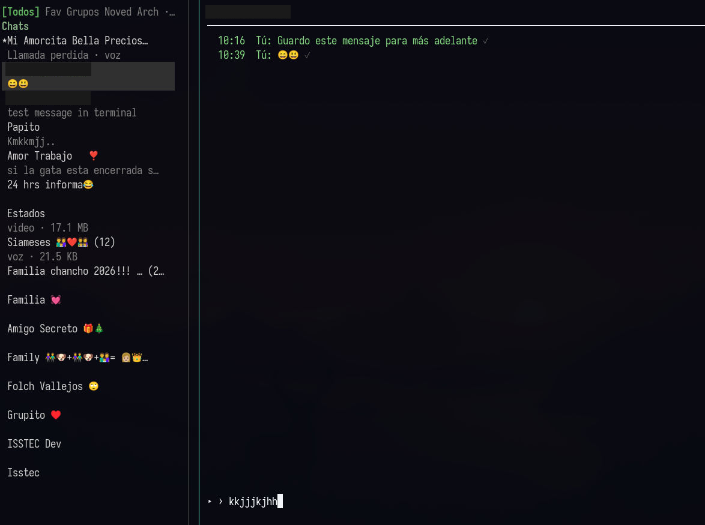

# wsp-tui

**WhatsApp en la terminal.** Cliente Multi-Device sin Chromium, sin Chrome y sin whatsapp-web.js.

Motor: [whatsmeow](https://github.com/tulir/whatsmeow) · UI: [Bubble Tea](https://github.com/charmbracelet/bubbletea)

> La UI nunca se bloquea por red, WhatsApp, SQLite o multimedia.

Repo: [github.com/efolchmontiel/wsp-tui](https://github.com/efolchmontiel/wsp-tui)



## Características

- Chats 1:1 y grupos, con filtros: **Todos / Favoritos / Grupos / Novedades (comunidades) / Archivados**
- Envío de texto, emojis (`Ctrl+E`), GIF (archivo `.gif`), adjuntos (`Ctrl+O`) y **notas de voz**
- **Reacciones** a mensajes (`r` + emoji; se muestran junto al texto)
- Ticks de estado: enviado / entregado / leído (azul)
- Mensajes temporales (Off → 24h → 7d → 90d) en 1:1 y grupos
- Archivar, favoritos (pin), búsqueda de chats/mensajes/contactos
- Agregar contacto por teléfono y verificar WhatsApp
- Media: abrir / descargar / recuperar; imágenes chicas se bajan solas
- Llamadas: banner entrante (amarillo) o perdida (rojo) — no se contestan desde la TUI
- Notificaciones de escritorio + sonido (Linux/`notify-send`)
- Retención local configurable (`week` / `month` / `3months` / `year` / `never`)
- Temas y pronombre Él/Ella para etiquetas del chat
- Sesión Multi-Device por QR o código de pairing
- Linux, Arch y Windows

## Quick path

1. Instalá dependencias (abajo, según tu OS).
2. `git clone https://github.com/efolchmontiel/wsp-tui.git && cd wsp-tui`
3. `make install` (o `go build -o wsp-tui ./cmd/whatstui`)
4. Corré `wsp-tui` · escaneá el QR · listo.

## Requisitos

| | Linux / Arch | Windows |
|---|---|---|
| Go | 1.22+ | 1.22+ |
| Terminal UTF-8 | sí | Windows Terminal recomendado |
| ffmpeg | para notas de voz | para notas de voz (WASAPI) |
| mpv | abrir audio/video | opcional (`mpv` o el opener del sistema) |
| notify-send / libnotify | notificaciones | opcional (sin toast nativo aún) |

## Instalación

### Arch Linux

```bash
sudo pacman -S go ffmpeg mpv libnotify
git clone https://github.com/efolchmontiel/wsp-tui.git
cd wsp-tui
make install   # instala wsp-tui, wstui y whatstui en ~/.local/bin
wsp-tui
```

### Linux (Debian/Ubuntu y derivados)

```bash
sudo apt update
sudo apt install golang-go ffmpeg mpv libnotify-bin
git clone https://github.com/efolchmontiel/wsp-tui.git
cd wsp-tui
make install
wsp-tui
```

### Windows

1. Instalá [Go](https://go.dev/dl/) y [ffmpeg](https://ffmpeg.org/download.html) (en PATH).
2. Abrí **Windows Terminal** o PowerShell:

```powershell
git clone https://github.com/efolchmontiel/wsp-tui.git
cd wsp-tui
go build -o wsp-tui.exe ./cmd/whatstui
.\wsp-tui.exe
```

Opcional: copiá `wsp-tui.exe` a una carpeta en tu PATH.

## Primer inicio — escanear el QR

```bash
wsp-tui
```

1. Si no hay sesión, aparece un **QR en la terminal**.
2. En el teléfono: **WhatsApp → Dispositivos vinculados → Vincular un dispositivo**.
3. Escaneá el QR.
4. Estado: **● Connected**.

En el próximo arranque reutiliza la sesión local (sin pedir QR otra vez).

### Alternativa: pairing code

1. En la pantalla de login, pulsá `p`.
2. Ingresá el número internacional **sin** `+` (ej. `54911…`).
3. Enter → código `ABCD-1234`.
4. En el teléfono: vincular con número de teléfono.

## Comandos CLI

```bash
wsp-tui              # iniciar
wsp-tui --version
wsp-tui --debug      # log a archivo
wsp-tui --logout     # cerrar sesión WhatsApp
wsp-tui --reset      # borrar sesión local
```

Aliases tras `make install`: `wstui`, `whatstui`.

## Atajos (por defecto)

| Tecla | Acción |
|-------|--------|
| `1`–`5` | Todos / Favoritos / Grupos / Novedades / Archivados |
| `Ctrl+E` | Panel **emoji / GIF** (insertar en el input) |
| `r` | **Reaccionar** al mensaje seleccionado (`[` / `]`) |
| `e` | Archivar / desarchivar |
| `f` / `*` | Favorito |
| `m` | Mensajes temporales (Off → 24h → 7d → 90d) |
| `a` | Agregar contacto (teléfono) |
| `/` o `Ctrl+F` | Buscar |
| `x` | Borrar chat **local** |
| `Ctrl+O` | Adjuntar archivo |
| `[` / `]` | Mensaje / adjunto anterior / siguiente |
| `o` / `d` | Abrir / descargar media |
| `v` | Nota de voz |
| `t` | Tema |
| `g` | Pronombre Él/Ella |
| `?` | Ayuda |
| `q` | Salir |

### Emoji, reacciones y GIF

1. **Enviar emoji:** en el input, `Ctrl+E` → elegí con flechas → `Enter` inserta → `Enter` otra vez envía.
2. **GIF:** `Ctrl+E` → `Tab` hasta **GIF** → `Enter` → elegí un `.gif` del disco.
3. **Reaccionar:** con `[` / `]` apuntá el mensaje → `r` → elegí emoji → `Enter`. `Backspace` en el panel quita tu reacción.

Llamadas: banner amarillo = entrante · rojo claro = perdida (no se contestan desde la TUI).

## Configuración

Archivo (se crea solo al primer arranque):

| OS | Ruta |
|----|------|
| Linux / Arch | `~/.config/whatstui/config.toml` |
| Windows | `%APPDATA%\whatstui\config.toml` |

```toml
theme = "dark"
mouse = true

# Limpieza del cache LOCAL (no toca el teléfono).
# week | month | 3months | year | never
local_retention = "3months"
```

| Valor | Significado |
|-------|-------------|
| `week` | borra local > 1 semana |
| `month` | > 1 mes |
| `3months` | > 3 meses (**default**) |
| `year` | > 1 año |
| `never` | no limpia nunca |

## Datos locales

| OS | Datos | Logs |
|----|-------|------|
| Linux | `~/.local/share/whatstui/` | `~/.local/state/whatstui/whatstui.log` |
| Windows | `%LOCALAPPDATA%\whatstui\` | mismo árbol |

Ahí viven `session.db`, `whatstui.db` y `media/`.

## Troubleshooting

| Problema | Qué hacer |
|----------|-----------|
| QR no se ve | Terminal UTF-8 / fuente mono; probá `--debug` y el log |
| Sesión rota | `wsp-tui --logout` o `--reset` y volvé a vincular |
| Sin audio en Linux | `ffmpeg` + Pulse/PipeWire |
| Sin audio en Windows | `ffmpeg` con WASAPI en PATH |
| “client outdated” | Actualizá `go.mau.fi/whatsmeow` |
| Panel en negro / scroll raro | Actualizá a ≥ 0.6.2 (truncate ANSI + filas del sidebar) |

## Licencia

MIT (app). whatsmeow: MPL-2.0. Ver [docs/licenses.md](docs/licenses.md).

## Docs

- [Architecture](docs/architecture.md)
- [Roadmap](docs/roadmap.md)
- [Performance](docs/performance.md)
- [Development](docs/development.md)
